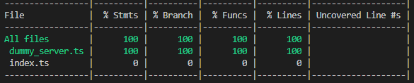

# Coverage

Coverage is a framework which runs your tests, keeping track of every linearly independent paths through your code and marking which path is or isn't touched by a test. You know your code is 100% tested when every statement, branch (of ifs and switches), functions and line is contemplated.

## Istanbul

[Istanbul](https://istanbul.js.org/) is the instrumentation tool, [nyc](https://github.com/istanbuljs/nyc) is its command line client. Simply precede your test command line with `nyc` and at the end of all tests and you'll get a report line this:

If you wish to generate a neat HTML to visualize your code marked with coverage information, precede your test command with `nyc --reporter=html`

## Codecov and Coveralls

[Codecov](https://codecov.io/gh/rcmedeiros/template/src/master/src/dummy_server.ts) and [Coveralls](https://coveralls.io/builds/22227513/source?filename=src/dummy_server.ts) are, might I say, identical services. They display a report very much like the one you get from `nyc --reporter=html`. Both read the [LCOV](https://wiki.documentfoundation.org/Development/Lcov) format thus requiring you to run `nyc report --reporter=text-lcov` and if you ask stackshare, both have [very similar popularity](https://stackshare.io/stackups/codecov-vs-coveralls).